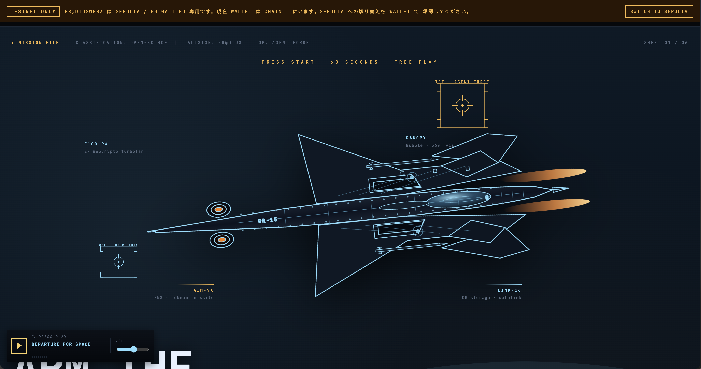
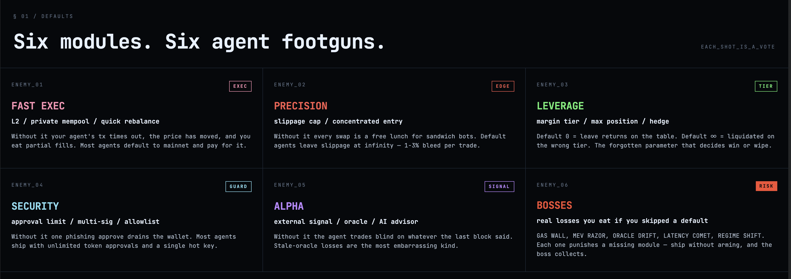
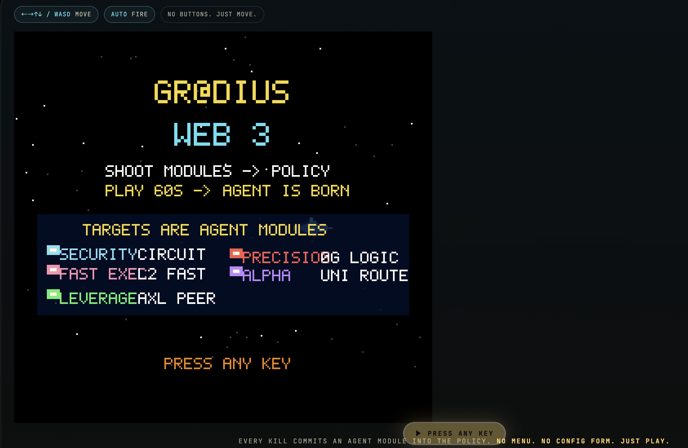
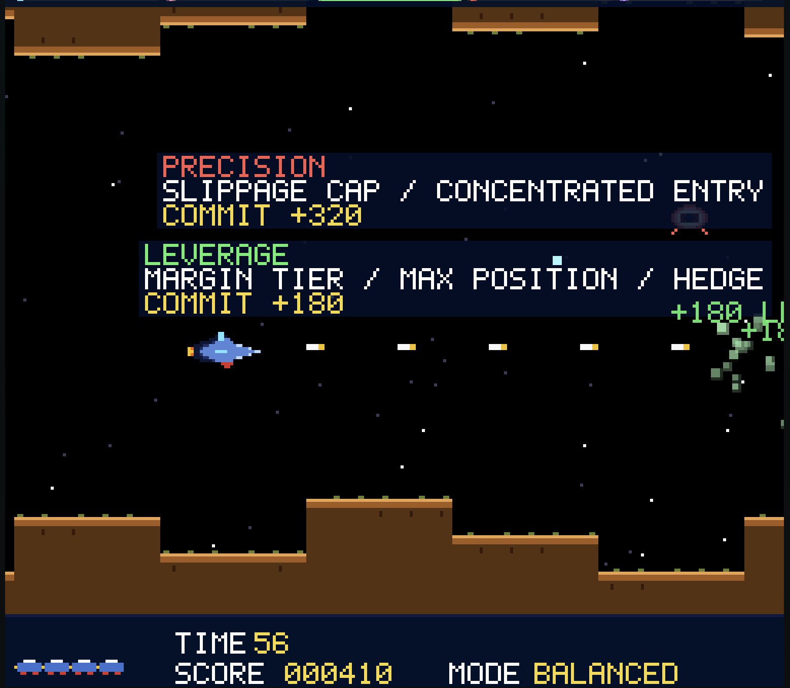
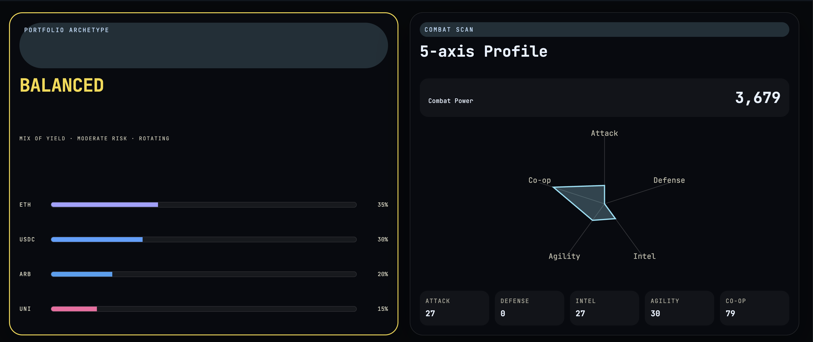
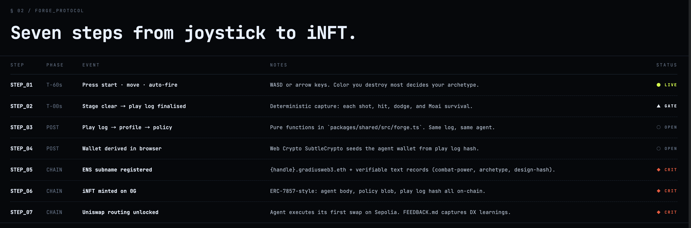

<div align="center">

# Gr@diusWeb3

**Kill the tradeoffs. Play to design your AI agent.**

[](./LICENSE)
[](https://bun.sh)
[](https://vitejs.dev)
[](https://getfoundry.sh)

[**▶ Live demo**](https://gr-dius-web3-frontend.vercel.app/) ·
[**Deployed iNFT (0G Galileo)**](https://chainscan-galileo.0g.ai/token/0xcb74b0e49db3968b4e8ceb70efaaa6bb668346d7) ·
[**Pitch deck**](./pitch_deck.md) ·
[**Agent runbook**](./AGENT.md) ·
[**Sponsor prizes**](./docs/prizes/)



</div>

---

## What it is

A 60-second retro arcade where every shot is a vote. The color you destroy most becomes your agent's archetype. One run mints an iNFT on 0G Galileo, registers a subname on Sepolia ENS, and signs the agent's first swap on Sepolia Uniswap. Real wallet, real testnet, no mainnet path.



---

## Play it in 60 seconds

```
1. Page loads → press any key.
2. ←→↑↓ or WASD to move. Auto-fire.
3. CYAN = SAFE / YELLOW = MID / RED = RISK.
4. Color you destroy most = your archetype.
5. Dodge Moai bosses.
6. After 60s: stage clear. Your agent is born.
```

| Game start | Mid-run vote | The result |
|:---:|:---:|:---:|
|  |  |  |

The pipeline is deterministic — same play log → same agent → same iNFT `tokenId`.



---

## Why it can't hit mainnet

Four independent layers. Even a future contributor who skips the docs cannot ship a mainnet write path.

| Layer | What it does |
|---|---|
| `wagmi` config | Only `[sepolia, galileo]` are registered. |
| `ensureChain` allowlist | Every `writeContract` asserts target ∈ allowlist. |
| `TestnetGuard` | Auto-fires `wallet_switchEthereumChain` to Sepolia on connect. |
| Hardcoded swap cap | `executeFirstSwap` is `parseEther('0.0001')`, not env-driven. |

Sources: [`web3/utils.ts`](./packages/frontend/src/web3/utils.ts), [`lib/wagmi.ts`](./packages/frontend/src/lib/wagmi.ts), [`components/TestnetGuard.tsx`](./packages/frontend/src/components/TestnetGuard.tsx), [`web3/uniswap-swap.ts`](./packages/frontend/src/web3/uniswap-swap.ts).

---

## Local agent loop

After the forge runs, the dashboard hands off to a **Claude Code skill** that you install once and reuse forever. The deployed app holds zero LLM cost and zero private keys.

```bash
# one-time install (no repo clone required, works from any project)
npx skills add susumutomita/Gr-diusWeb3
```

Then run the loop:

```
[Browser]                          [Claude Code with agent-loop skill]
buildAgentLoopInput()              /agent-loop
 → clipboard / download                 ↓
                                   read AGENT.md (constitution)
                                   decide ONE PaperTradeAction (≤ 0.0001 ETH)
                                   write AgentLoopTrace JSON
 ← clipboard paste                      ↓
parseAgentLoopTrace() + budget check
 → "Approve & Sign on Testnet" (browser MetaMask)
```

`AGENT.md` is the constitution. The skill is the head. Browser MetaMask is the only signer. Every signed transaction is capped at 0.0001 ETH on a testnet.

---

## Run it

Requires [Bun](https://bun.sh) ≥ 1.3 and [Foundry](https://getfoundry.sh) (only for contracts).

```bash
bun install
make dev               # http://localhost:5173
make before-commit     # lint + typecheck + test + build
make pitch_pdf         # build the submission deck
```

### Make the iNFT live

The repo ships a deploy script for `AgentForgeINFT.sol`, but the iNFT row of the dashboard fails until you actually deploy and tell the frontend where the contract lives. Never import your daily-driver private key — generate a disposable deployer instead:

```bash
# one-time: generate a fresh wallet + import it into the encrypted keystore
make deploy_setup

# fund the printed address with 0G Galileo + Sepolia testnet ETH (faucets),
# then deploy. Each `make deploy_*` command prompts for the keystore password.
make deploy_galileo          ACCOUNT=deployer SENDER=0xYourAddress
make deploy_sepolia          ACCOUNT=deployer SENDER=0xYourAddress
make deploy_base_sepolia     ACCOUNT=deployer SENDER=0xYourAddress
make deploy_op_sepolia       ACCOUNT=deployer SENDER=0xYourAddress
make deploy_arbitrum_sepolia ACCOUNT=deployer SENDER=0xYourAddress

# or every chain in one shot
make deploy_all ACCOUNT=deployer SENDER=0xYourAddress

# forgot your deployer address? print it
make deploy_address
```

Per chain, copy the printed contract address into the Vercel project as `VITE_INFT_ADDRESS=0x...` and redeploy the frontend so the dashboard's iNFT mint can target it. Sepolia-family deploys verify on Etherscan automatically; Galileo skips verify (no Etherscan API yet).

Signing always goes through Foundry's CLI flags — keystore (`ACCOUNT=...`), Ledger (`LEDGER=1`), Trezor (`TREZOR=1`), or interactive (`INTERACTIVE=1`). No raw private keys in `.env`, ever.

---

## For prize judges

| What to verify | Where |
|---|---|
| Live demo (~60 s) | https://gr-dius-web3-frontend.vercel.app/ |
| **Deployed iNFT contract** on 0G Galileo (chain 16602) | [`0xcB74b0E49dB3968b4e8cEB70EFAaA6bb668346D7`](https://chainscan-galileo.0g.ai/token/0xcb74b0e49db3968b4e8ceb70efaaa6bb668346d7) (live, ERC-721 with deterministic `tokenId`) |
| iNFT contract source + mint client | [`contracts/src/AgentForgeINFT.sol`](./contracts/src/AgentForgeINFT.sol), [`web3/zerog-mint.ts`](./packages/frontend/src/web3/zerog-mint.ts) |
| 0G Storage real put + sha256 fallback | [`web3/zerog-storage.ts`](./packages/frontend/src/web3/zerog-storage.ts) |
| ENS Sepolia subname (NameWrapper + Resolver, text records) | [`web3/ens-register.ts`](./packages/frontend/src/web3/ens-register.ts) |
| Uniswap v3 Sepolia first trade (WETH→USDC, 0.0001 ETH cap) | [`web3/uniswap-swap.ts`](./packages/frontend/src/web3/uniswap-swap.ts) |
| Uniswap DX feedback (required for prize) | [`FEEDBACK.md`](./FEEDBACK.md) |
| Agent safety attestation (3-tier credential) | [`shared/safety.ts`](./packages/shared/src/safety.ts), [`web3/safety-attestation.ts`](./packages/frontend/src/web3/safety-attestation.ts) |
| Demo seed (`?seed=demo`) for misalignment showcase | [`game/runtime.ts`](./packages/frontend/src/game/runtime.ts) |
| Testnet-only guard + agent loop runbook | see the two sections above |
| Spec + Plan log | [`docs/specs/`](./docs/specs/), [`Plan.md`](./Plan.md) |

---

## Tech stack

Bun · Vite · React 19 · Canvas 2D · TypeScript · Biome · viem · wagmi · Foundry (Solidity 0.8.28) · 0G Storage SDK · ENS NameWrapper · Uniswap v3 · `@marp-team/marp-cli` (lockfile-pinned, no `bunx`) · Claude Code as local agent runtime · Vercel static deploy.

---

## Sponsor integrations

| Sponsor | Role |
|---|---|
| **0G** | iNFT on 0G Galileo (chain 16602) + play log on 0G Storage; root hash pinned in iNFT metadata and ENS text record. |
| **ENS** | Wallet-deterministic subname `{4-hex}.gradiusweb3.eth` on real Sepolia ENS, with safety credential text records. |
| **Uniswap** | Real WETH→USDC swap on Sepolia v3, capped at 0.0001 ETH. |
| **Gensyn AXL** | Multi-agent peer-mesh topology surfaced in the dashboard. |
| **KeeperHub** | Reliable execution narrative (private mempool, retries) in the runtime. |

Prize requirements live in [`docs/prizes/`](./docs/prizes/).

---

## Repository layout

```
packages/frontend/         Vite + React + Canvas (the deployable)
  src/game/                NES-grade engine (palette, sprites, font, terrain, runtime)
  src/components/          BirthArcade · AgentDashboard · AgentLoopPanel · TestnetGuard
  src/web3/                forge-onchain · ens-register · uniswap-swap · zerog-* · utils
  src/lib/wagmi.ts         testnet-only chains: [sepolia, galileo]
packages/shared/           Pure functional core (profile · policy · forge · agent-loop)
contracts/                 Solidity + Foundry (AgentForgeINFT.sol, multi-chain Deploy.s.sol)
.claude/skills/agent-loop/ Claude Code skill (install via `npx skills add`)
docs/                      specs · prizes · architecture/harness.md
images/                    hero + gameplay + dashboard screenshots
pitch_deck.md              Marp deck (7 slides). Build: `make pitch_pdf`.
AGENT.md                   Local autonomous agent runbook (testnet-only).
CLAUDE.md                  Contributor guide (Japanese).
```

---

## Roadmap

- Multi-cycle agent loop (today: one paper trade per game)
- On-chain leaderboard
- Agent breeding (iNFT × iNFT → child iNFT)
- Mainnet readiness audit (would require a 5th guard + ADR)
- Mobile arcade (touch controls)

---

## Contributing

Read [`CLAUDE.md`](./CLAUDE.md) and [`AGENT.md`](./AGENT.md). `make before-commit` must be green. Conventional Commits. Refer to issues as `Issue 番号` (never `#番号` — auto-close protection).

The invariants in [`docs/architecture/harness.md`](./docs/architecture/harness.md) are non-negotiable. If your change conflicts, the invariant wins until you write an ADR superseding it.

---

[MIT](./LICENSE) © 2026 Susumu Tomita

> Insert a coin. Play 60 seconds. Walk away with an autonomous agent.
