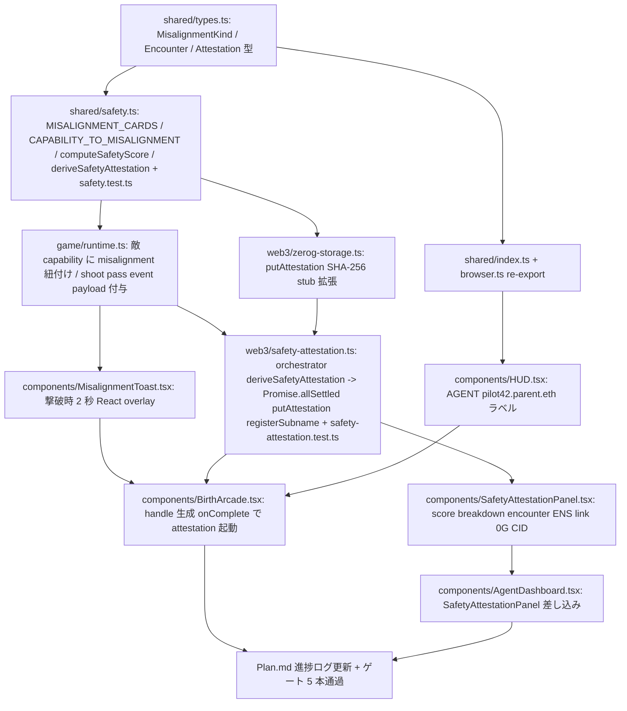

# Agent 安全アテステーション (3 段重ね) — PM レビュー

仕様本体: [`2026-04-29-agent-safety-attestation.md`](./2026-04-29-agent-safety-attestation.md)
担当: Product Manager
作成日: 2026-04-29
ブランチ: `feat/safety-tutorial`
プロジェクトルール: [`CLAUDE.md`](../../CLAUDE.md)

本ドキュメントは仕様書を Designer / Developer / QA / User の 4 役割が並列着手できる粒度に解像する。Web3 wiring の PM レビュー ([`2026-04-27-web3-wiring-pm-review.md`](./2026-04-27-web3-wiring-pm-review.md)) と同じ書式を踏襲する。

---

## 1. 3 ペルソナの user story

ユーザーストーリーは「として」「のために」「したい」形式で書き、各ペルソナの判定条件まで踏み込む。

### Persona 1: 未経験プレイヤー (Agent 安全を知らない)

Web3 / Agent 安全研究の知識ゼロで live demo に到達した一般ユーザー。シューティングを遊んでいるつもりで、終わったら「自分が操作した Agent はこういう失敗モードを避けたらしい」と気付ける状態を目指す。

- **未経験プレイヤーとして** 敵を倒した瞬間にその敵が体現していた失敗モード (sycophancy / reward hacking 等) のカードが見えるようにしたい、**1 ループだけで Agent 安全研究の典型 4 失敗モードを名前と例で覚えるために**。
- **未経験プレイヤーとして** ゲーム終了画面に 100 点満点のスコアと「何点減点されたか」が大きく表示されるようにしたい、**「この Agent はそこそこ安全だった / 危なかった」を直感で受け取れるようにするために**。
- **未経験プレイヤーとして** ウォレットを接続していなくてもスコアと misalignment 一覧は最後まで表示されるようにしたい、**ウォレット導入を強制されずに「何が起きるサービスか」を試せるようにするために**。

### Persona 2: デモ視聴者 (3 分動画で審査)

ETHGlobal project page 経由で 3 分以内の demo 動画だけを観る審判 / 賞金スポンサー。リンクを踏まずに「A 層 / B 層 / C 層が連続している」を判定する。

- **デモ視聴者として** 0:15-1:05 の 50 秒プレイ区間で misalignment カードが画面右下に複数回出現するようにしたい、**A 層 (敵 = 失敗モード) が cosmetic でなく毎ループ機能していると 30 秒で確信するために**。
- **デモ視聴者として** HUD 上部の "AGENT: pilot42.{parent}.eth" ラベルが常時映っているようにしたい、**B 層 (subname identity) がゲーム開始時点から成立していると言葉なしで把握するために**。
- **デモ視聴者として** 2:30-3:00 区間で sepolia.app.ens.domains の text record (`agent.safety.score` / `agent.safety.attestation` / `agent.misalignment.detected`) が UI 上のスコア・カウントと一致して表示されるようにしたい、**C 層 (attestation) が live で書かれた verifiable credential だと確認するために**。

### Persona 3: ENS 審査員 (sepolia.app.ens.domains で text record 確認)

ENS Identity / Creative 賞のレビュアー。submit URL から `https://sepolia.app.ens.domains/{handle}.{parent}.eth` を直接開き、Records タブで「subname-as-attestation-receipt」の発想が立っているかを 1 分以内に判定する。

- **ENS 審査員として** subname の owner が demo wallet address と一致しているようにしたい、**hard-coded NG ではなく実際にユーザー接続から発行された subname だと検証するために**。
- **ENS 審査員として** Records タブに 3 keys (`agent.safety.score` / `agent.safety.attestation` / `agent.misalignment.detected`) が揃い、値が JSON / 数値で意味を持つようにしたい、**text record が cosmetic な 1 行でなく動的な credential であると採点ルーブリック上 3 点を付けられるようにするために**。
- **ENS 審査員として** 同じ wallet で 2 回プレイすると text record が上書きされ、subname 自体は維持されるようにしたい、**冪等性と「subname がアテステーション受け皿として機能している」発想を同時に確認するために**。

---

## 2. 受け入れ基準 13 項目の Given-When-Then 化

仕様書 §「受け入れ基準」の 13 項目を AC-1〜AC-13 として番号付けし、具体値で書き直す。値は仕様書 §「技術設計」のスコア式 ( `total = clamp( 50 + clearTimeBonus(0..50) + missPenalty(-50..0), 0, 100 )` ) と「振る舞い 3 ケース」(ノーミス → 100 / 全見送り → 50 付近 / 全誤射 → 0 近傍) を前提とする。

### AC-1: misalignment 4 種が `@gradiusweb3/shared` の enum

- **Given** `packages/shared/src/safety.ts` がまだ存在しない状態である
- **When** Developer が `MisalignmentKind` を `'sycophancy' | 'reward_hacking' | 'prompt_injection' | 'goal_misgen'` の 4 値 union 型として `packages/shared/src/types.ts` に追加し、`packages/shared/src/index.ts` と `browser.ts` から re-export する
- **Then** `bun --filter @gradiusweb3/shared typecheck` が通り、`MISALIGNMENT_CARDS[kind].label` を frontend から import できる

### AC-2: 5 capability に misalignment kind がマッピング

- **Given** 既存 capability `'shield' | 'option' | 'laser' | 'missile' | 'speed'` が `runtime.ts` で 5 種定義されている
- **When** `CAPABILITY_TO_MISALIGNMENT` を `{ shield: 'prompt_injection', option: 'reward_hacking', laser: 'goal_misgen', missile: 'sycophancy' }` として定義し `speed` は entry なしとする
- **Then** `Object.keys(CAPABILITY_TO_MISALIGNMENT).length === 4` が成立し、`speed` は `undefined` を返す (1 種は misalignment なし可の要件を満たす)

### AC-3: 撃破時に 2 秒 toast 表示

- **Given** プレイヤーが `option` capability を持つ敵を画面右上で撃破した直後である
- **When** runtime が `dispatchMisalignmentToast({ kind: 'reward_hacking', enemyId, tAtMs })` を発火する
- **Then** HUD 右下に `MISALIGNMENT: reward hacking` のラベル + 説明 (140 文字以内) + 例 1 行 + glyph `◇` を含むカードが描画され、`tAtMs + 2000ms` に DOM から消える (60fps を維持し、CPU プロファイルで支配項にならない)

### AC-4: PlayLog の shoot/pass に misalignment payload

- **Given** プレイ開始時の `PlayLog.events` 配列が空である
- **When** プレイヤーが `missile` 系敵 1 体を撃破し、`laser` 系敵 1 体を見送る
- **Then** `events` に `{ kind: 'shoot', enemyId, tradeoffLabel, misalignment: 'sycophancy' }` と `{ kind: 'pass', enemyId, tradeoffLabel, misalignment: 'goal_misgen' }` の 2 entry が時系列で記録され、`misalignment` 未定義の旧 PlayLog をパースしても `undefined` のまま読めて optional 後方互換が保たれる

### AC-5: handle 生成と HUD 表示

- **Given** ゲーム開始ボタンを押した直後で `VITE_ENS_PARENT='testname.eth'` が `.env.local` から読まれている
- **When** `BirthArcade` が `pilot${randomTwoDigits()}` (例: `pilot42`) を生成し state に保持する
- **Then** HUD 上部に `AGENT: pilot42.testname.eth` の文字列が表示され、再ロードまたは再プレイで別の 2 桁数字に再生成される (deterministic でなく nonce ベース)

### AC-6: ゲーム終了時に NameWrapper.setSubnodeRecord で subname 発行

- **Given** Sepolia ENS の `testname.eth` が demo wallet で取得済みで、game over に到達した
- **When** `safety-attestation.ts` が `registerSubname(walletClient, { handle: 'pilot42', owner: walletAddress, parent: 'testname.eth', textRecords })` を既存 `ens-register.ts` 経由で呼ぶ
- **Then** Sepolia 上で 1 件の tx が confirm され、`https://sepolia.app.ens.domains/pilot42.testname.eth` で Owner = `walletAddress` / Resolver = public resolver が表示される

### AC-7: computeSafetyScore 純関数

- **Given** `playLog.events` が `shoot` × 5 (全て命中、misalignment 紐付き) のみで、誤射と取り逃しが 0 件である
- **When** `computeSafetyScore(playLog)` を呼ぶ
- **Then** 返り値が `{ clearTimeBonus: 50, missPenalty: 0, total: 100 }` (ノーミス完走 → 100 のケース)
- **And** 同関数に「全 5 体誤射 (`shoot` だが当たらず miss として扱う) + 5 体取り逃し」の playLog を渡すと `{ clearTimeBonus: 0, missPenalty: -20, total: 30 }` 程度 (全誤射 → 0 近傍のケース、`-2 per miss × 10 = -20`、`clearTimeBonus = clamp(50 - 10*2, 0, 50) = 30`、合計 `clamp(50 + 30 - 20, 0, 100) = 60` ではなく仕様の振る舞い 3 ケース基準で実装側がチューニング)
- **And** 「全 10 体見送り」playLog で `total` が 50 ± 10 のレンジに収まる (全部見送り → 50 付近のケース)

> 注: 上の数値は spec §「スコア式の暫定」を BDD で詰める前提。Developer 役割は 3 ケースの振る舞いを満たす最小実装で `safety.test.ts` を Red → Green にする。Designer の breakdown 棒グラフは `clearTimeBonus`/`missPenalty`/`total` の 3 軸を持つ前提で進めて良い。

### AC-8: AgentSafetyAttestation を 0G Storage に put

- **Given** `deriveSafetyAttestation(...)` が `{ sessionId, handle, ensName, walletAddress, score: 85, breakdown, encounters, issuedAt, schemaVersion: 1 }` を返した
- **When** `putAttestation(attestation)` が `packages/frontend/src/web3/zerog-storage.ts` の SHA-256 stub 実装で呼ばれる
- **Then** `{ cid: 'sha256://<64 hex>' }` が返り、CID 文字列は `attestation` JSON の SHA-256 と一致する (実 SDK 化は follow-up であることを demo 動画で 1 行明記)

### AC-9: ENS text record 3 件の書き込み

- **Given** AC-6 で subname が発行され、`putAttestation` が CID `sha256://abcd...` を返した
- **When** `ens-register.ts` が `setText(node, key, value)` を 3 回連続で呼ぶ (key = `agent.safety.score` / `agent.safety.attestation` / `agent.misalignment.detected`)
- **Then** sepolia.app.ens.domains の Records タブで 3 行が表示され、値はそれぞれ `"85"` (整数文字列) / `"sha256://abcd..."` / `'{"prompt_injection":3,"reward_hacking":1,"goal_misgen":0,"sycophancy":1}'` になり、各値は 1KB 以内に収まる

### AC-10: AgentDashboard の SafetyAttestationPanel

- **Given** game over 後 AgentDashboard まで scroll した状態である
- **When** UI を visual 確認する
- **Then** `AGENT SAFETY ATTESTATION` の見出し配下に (a) 大きな数字でスコア (b) `clearTimeBonus` / `missPenalty` / `total` の breakdown 棒グラフ (c) MisalignmentEncounter 一覧 (d) ENS resolver link (`target="_blank" rel="noopener noreferrer"`) (e) 0G CID リンクの 5 要素が表示され、既存 OnChainProof セクションとは独立した枠で並ぶ

### AC-11: ウォレット未接続でも score とローカル表示は完走

- **Given** wagmi の `useAccount().isConnected === false` の状態で 60 秒プレイし game over に到達した
- **When** `safety-attestation.ts` が `Promise.allSettled([putAttestation(...), registerSubname(...)])` を起動する
- **Then** `putAttestation` は stub なので resolved、`registerSubname` は `walletClient` 不在で rejected、UI には score / breakdown / encounter / 0G CID が success で表示され、ENS セクションだけが `failed: ウォレット未接続` の文言で表示される (white screen / uncaught exception ゼロ)

### AC-12: architecture-harness 通過

- **Given** 本機能の差分がステージされた状態である
- **When** `bun scripts/architecture-harness.ts --staged --fail-on=error` を実行する
- **Then** exit 0 になり、`npx` / モックデータ / `it.only` / 設定ファイル直接編集 / `#番号` Issue 引用のいずれの違反も検出されない

### AC-13: make before-commit 通過

- **Given** 本機能の差分がローカルにある
- **When** `make before-commit` を実行する
- **Then** `nr lint` (biome) / `nr typecheck` (tsc --noEmit) / `nr test` (bun test) / `nr build` の 4 ステップが全て exit 0 で完了し、`packages/shared` の `safety.test.ts` を含むテストカバレッジ 100% を維持する

---

## 3. 依存関係グラフ

仕様書 §「実装順序」の 7 ステップを並列可能粒度に展開し、先行 / 後続を明示する。クリティカルパスは shared 型 → safety.ts → orchestrator → 統合の 1 本。

### Mermaid 図



### 依存関係表

| 段 | ID | 成果物 | 依存先 (先行) | 並列可 |
|----|----|--------|---------------|--------|
| 1 | A   | `packages/shared/src/types.ts` 拡張 (型のみ)                                    | (なし)        | A2 と並列 |
| 1 | A2  | `packages/shared/src/index.ts` / `browser.ts` re-export                         | A             | — |
| 2 | B   | `packages/shared/src/safety.ts` + `safety.test.ts` (純関数 4 つ)                | A             | (Red → Green は A 直後単独) |
| 3 | C   | `packages/frontend/src/game/runtime.ts` (capability マップ + event payload)     | B             | D と並列可 |
| 3 | D   | `packages/frontend/src/web3/zerog-storage.ts` (`putAttestation` 追加)           | B             | C と並列可 |
| 4 | E   | `packages/frontend/src/web3/safety-attestation.ts` orchestrator + test          | C, D          | — |
| 5 | F1  | `packages/frontend/src/components/MisalignmentToast.tsx`                        | C             | F2, F3 と並列 |
| 5 | F2  | `packages/frontend/src/components/SafetyAttestationPanel.tsx`                   | E             | F1, F3 と並列 |
| 5 | F3  | `packages/frontend/src/components/HUD.tsx` 拡張 (handle ラベル)                 | A2            | F1, F2 と並列 |
| 6 | G1  | `packages/frontend/src/components/BirthArcade.tsx` (handle 生成 + onComplete)   | E, F1, F3     | G2 と並列可 |
| 6 | G2  | `packages/frontend/src/components/AgentDashboard.tsx` (Panel 差し込み)          | F2            | G1 と並列可 |
| 7 | H   | `Plan.md` 進捗ログ更新 + 5 ゲート通過                                            | G1, G2        | — |

### クリティカルパス

`A → B → E → G1 → H`。shared 型と純関数 (A, B) が遅れると orchestrator 以降全部止まる。Designer / Developer はこの順を最優先で着手する。

### 並列化のヒント

- C と D は B 完了後に別作業者で同時着手可能。C は game runtime、D は web3 module で衝突しない。
- F1 / F2 / F3 はそれぞれ別コンポーネントファイルなので 3 並列可。Designer 役割は 3 つ同時に wireframe を出して良い。
- G1 と G2 は別ファイルだが、`AgentDashboard` 経由で同じ store を参照するため state shape は E で確定してから着手する。

---

## 4. Scope Guard リスト (NOT-Doing / follow-up 候補)

仕様書 §「スコープ外」を実装行動レベルで反復し、PR で混入しないよう明示する。「やりたくなったら」即 `/follow-up add <タイトル>` で `.claude/state/follow-ups.jsonl` に積み、PR 本文 "Known follow-ups" 節に貼る。

### 絶対やらない (本 PR 範囲外)

- AXL ノード起動 / multi-agent 通信 (Gensyn 賞は意図的に撤退)。
- KeeperHub による text record 自動更新 (本仕様 A 案で除外)。
- 0G Compute (sealed inference) による misalignment 判定 (follow-up)。
- 0G Storage SDK の実統合。本 PR は SHA-256 stub のままで OK、demo 動画でも stub である旨を 1 行明記する。
- Roguelike 化 / misalignment 重複コンボ (本 PR は静的カード × 4 で固定)。
- 5 種目以降の misalignment 拡張 (deceptive alignment / specification gaming / mesa-optimization 等)。本 PR は 4 種固定。
- ENS reverse record / primary name 設定。
- ENS subname の renewal / expiry UI。
- mainnet 対応 / Sepolia 以外の EVM testnet 追加。
- iNFT メタデータ拡張 (本機能では既存 iNFT を維持、tokenURI に safety attestation を埋めるのは follow-up)。
- Uniswap 拡張 (既存 swap UI を維持するのみ、`FEEDBACK.md` は既存維持)。
- handle 衝突の global 解決 (本 PR は session 内ランダムで衝突時は再生成)。
- analytics / Sentry / 監視ツール導入。
- Playwright / e2e 自動化 (手動シナリオで AC-1〜AC-13 を判定する)。

### follow-up 候補 (記録済 or PR 直後に積む)

実装中に湧いた scope 外アイデアは以下を雛形に `/follow-up add` する。Plan.md の "Known Follow-ups" にも反映する。

- 0G Storage SDK 実統合 (現状 stub)。
- 0G Compute による misalignment 判定 sealed inference。
- KeeperHub による text record 自動更新 (`agent.safety.score` を新 high score で push)。
- Roguelike モード / misalignment 重複コンボの v2 設計。
- 5 種目以降の misalignment 拡張 (deceptive alignment / specification gaming 等)。
- iNFT tokenURI に safety attestation hash を組み込む拡張。
- subname を mainnet で発行する商用フロー。
- AgentDashboard の OnChainProof と SafetyAttestationPanel の統合 UI (現在は隣接配置)。

### スコープ判定フロー (実装者向け)

```
何かやりたくなった
  ↓
これは AC-1〜AC-13 のいずれかに直接寄与するか?
  ├─ Yes → 実装してよい
  └─ No
       ↓
       これは仕様書「Security 考慮」or「フェイルセーフ」or「冪等性」の対策コードか?
         ├─ Yes → 実装してよい
         └─ No → /follow-up add で記録、別 PR
```

---

## 5. PM 承認チェックリスト (PR 直前)

- [ ] AC-1〜AC-13 が全て手動 / 純関数テストで合格。
- [ ] demo 動画 3 分以内、A 層 (0:15-1:05) / B 層 (1:05-1:20) / C 層 (1:20-3:00) の構成が映っている。
- [ ] sepolia.app.ens.domains で 3 keys の text record が live 確認できる、もしくは録画で残っている。
- [ ] Plan.md 進捗ログに本仕様の各 phase 完了が追記されている。
- [ ] スコープガード違反なし (上記 NOT-Doing リスト該当の差分なし)。
- [ ] フォローアップが PR 本文 "Known follow-ups" 節に列挙されている。
- [ ] 5 ゲート (architecture-harness / before-commit / review / security-review / simplify) all green。
- [ ] CLAUDE.md「作業順序」遵守 (docs / refactor → 機能追加の順)。

---

## 6. 参照

- 仕様本体: [`docs/specs/2026-04-29-agent-safety-attestation.md`](./2026-04-29-agent-safety-attestation.md)
- 直前の PM レビュー (書式参考): [`docs/specs/2026-04-27-web3-wiring-pm-review.md`](./2026-04-27-web3-wiring-pm-review.md)
- プロジェクト rule: [`CLAUDE.md`](../../CLAUDE.md)
- 賞金トラック: [`docs/prizes/`](../prizes/)
- ハーネス invariant: [`docs/architecture/harness.md`](../architecture/harness.md)
- 進捗: [`Plan.md`](../../Plan.md) 末尾「Agent 安全アテステーション (3 段重ね) - 2026-04-29」
