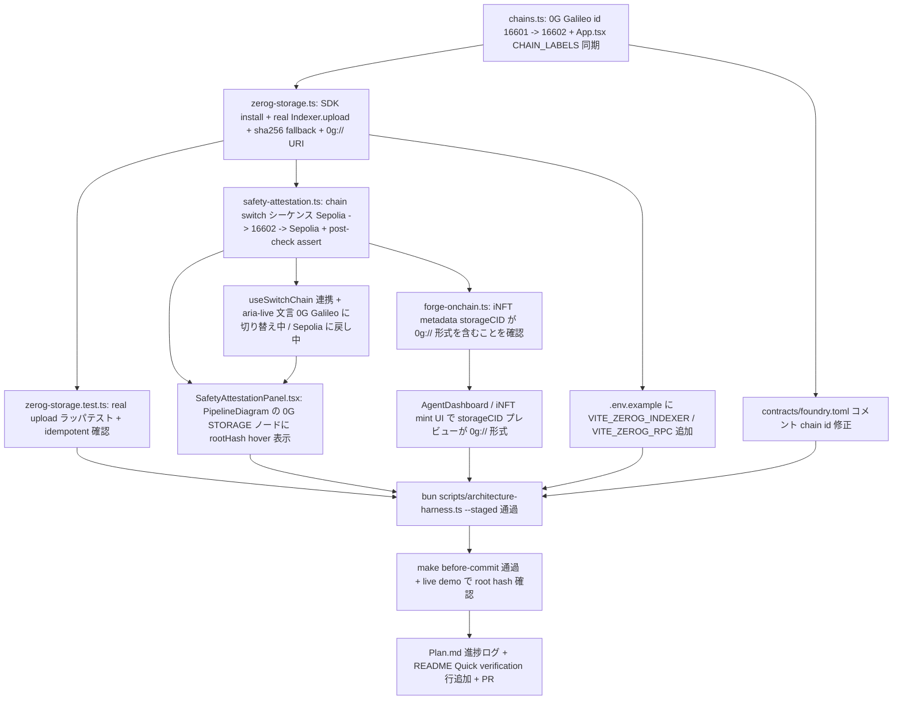

# 0G Storage SDK 実統合 — PM レビュー

仕様本体: [`2026-05-01-zerog-storage-real.md`](./2026-05-01-zerog-storage-real.md)
担当: Product Manager
作成日: 2026-05-01
ブランチ: `feat/zerog-storage-real`
プロジェクトルール: [`CLAUDE.md`](../../CLAUDE.md)

本ドキュメントは仕様書を Designer / Developer / QA / User の 4 役割が並列着手できる粒度に解像する。直前の PM レビュー ([`2026-04-29-agent-safety-attestation-pm-review.md`](./2026-04-29-agent-safety-attestation-pm-review.md)) と同じ書式を踏襲する。今回の主役は 0G Storage 賞であり、judge が 0G storage explorer で実 root hash を検索できる状態を最重要 KGI とする。

---

## 1. 4 ペルソナの user story

ユーザーストーリーは「として」「のために」「したい」形式で書き、各ペルソナの判定条件まで踏み込む。今回は「賞別 judge 2 種」と「プレイヤー条件 2 種」の 4 ペルソナで spec の受け入れ基準と提出物を直接マッピングする。

### Persona 1: 0G Storage 賞審査員 (3 分動画で判定)

ETHGlobal の 0G Storage トラック (Autonomous Agents / Swarms / iNFT) を採点する審査員。submit URL から 3 分の demo 動画と live demo URL を順に開き、「stub でなく real Galileo testnet に書かれているか」「playLog / attestation の中身が JSON として読めるか」をルーブリックの 0-3 点で判定する。

- **0G Storage 賞審査員として** demo 動画 1:00-1:30 区間で wallet popup が `Switch to 0G-Galileo (chain 16602)` と明示されたうえで `Indexer.upload` が走る様子を観察したい、**ストレージ書込みが Galileo testnet で本当に発生していると 30 秒で確信して 3 点を付けるために**。
- **0G Storage 賞審査員として** AgentDashboard の PipelineDiagram の `0G STORAGE` ノードに `0g://0xa1b2...` のような root hash が hover で全文露出するようにしたい、**動画停止後に live demo URL を踏んで rootHash を即コピペし 0G storage explorer で検索できるようにするために**。
- **0G Storage 賞審査員として** explorer に貼り付けた root hash で attestation JSON (score / breakdown / encounters / handle / ensName) が表示されるようにしたい、**「Agent intelligence と memory が on-chain content-addressed storage に embedded」というクレームの裏付けを 1 分で取れるようにするために**。

### Persona 2: iNFT 審査員 (tokenURI metadata で memory embedded を検証)

0G iNFT トラック (intelligence-bearing NFT の memory embed) を採点する審査員。Sepolia の iNFT contract address から該当 tokenId を開き、`tokenURI()` の指す metadata JSON 中の `storageCID` フィールドを生で読む。

- **iNFT 審査員として** `tokenURI` が返す metadata の `storageCID` が `0g://0x...` 形式であり、かつ AgentDashboard 側で表示されている root hash と完全一致するようにしたい、**iNFT が単なる cosmetic JPEG ではなく content-addressed memory を抱えていると客観的に証明するために**。
- **iNFT 審査員として** 同じ wallet で 2 回 mint しても、playLog の中身が同一なら同じ root hash が再利用される (0G の content-addressed deduplication) ことを観察したい、**iNFT の identity と memory が結合されている (memory hash が冪等な指紋として機能する) と確認するために**。
- **iNFT 審査員として** `forge-onchain.ts` 経由でカスタム iNFT に書き込まれる `storageCID` が hard-coded ではなく runtime で derive された値であるソース証跡を README 経由で辿りたい、**「Cosmetic 統合ではなく meaningful integration」という Prize Targets 表 (2 点) の主張を信用するために**。

### Persona 3: 一般プレイヤー (Sepolia ETH のみ、0G testnet ETH 未保有)

ETHGlobal demo URL から流入し、Sepolia faucet までは持っているが 0G Galileo testnet ETH は未保有の一般ユーザー。0G upload は失敗する想定で、それでも体験が壊れず ENS subname と attestation の最低限が UI に残るかを判定する。

- **一般プレイヤーとして** 0G Galileo に switch chain した後の `Indexer.upload` が gas 不足等で失敗しても、UI に赤画面 / 例外スタックが出ずに `0G STORAGE: failed (sha256:// fallback)` の日本語メッセージで降格表示されるようにしたい、**testnet faucet を取り直さなくても demo を最後まで見られるようにするために**。
- **一般プレイヤーとして** 0G upload が失敗しても Sepolia への switchChain と ENS subname 発行 + text record 書込みは継続するようにしたい、**B 層 (subname identity) と C 層 (attestation) を最低限手元に残し「pilot42.testname.eth が自分のもの」と感じられるようにするために**。
- **一般プレイヤーとして** ENS text record の `agent.safety.attestation` が fallback 時には `sha256://{hex}` のまま記録されるようにしたい、**後で 0G testnet ETH を取得して再プレイすれば `0g://...` に上書きされる導線が見えるようにするために**。

### Persona 4: 両 chain 保有プレイヤー (Sepolia + 0G Galileo testnet ETH 両方持ち、5-6 popup を順承認)

Web3 慣れしていて wallet に Sepolia ETH と 0G Galileo testnet ETH を両方仕込んできた power user。chain switch popup を 5-6 個順番に承認する忍耐があり、live demo を完走させてから text record 確認まで自分でやる。

- **両 chain 保有プレイヤーとして** game over 時の wallet popup シーケンスが (1) Sepolia → 0G Galileo switchChain (2) `Indexer.upload` の signer 署名 (playLog) (3) `Indexer.upload` の signer 署名 (attestation) (4) 0G Galileo → Sepolia switchChain (5) `setText` × 3 連続署名 (6) subname 発行 tx 署名 の 5-6 ステップで予測可能順に出るようにしたい、**popup の順番が崩れて「これは何の署名?」と混乱しないために**。
- **両 chain 保有プレイヤーとして** 各 popup が出る前の HUD に `aria-live` で「0G Galileo に切り替え中」「Sepolia に戻し中」が表示されるようにしたい、**Metamask の chain 切替でブラウザ画面が一瞬止まる時に「進行中」と理解できるようにするために**。
- **両 chain 保有プレイヤーとして** 全 popup を承認した後 PipelineDiagram の 4 ノード (`PLAY LOG` → `SAFETY SCORE` → `0G STORAGE` → `ENS RECORD`) が緑表示になり、各ノードに root hash / subname / explorer link が出るようにしたい、**自分の操作が「real on-chain demo を 1 ループで完走させた」結果として可視化されるようにするために**。

---

## 2. 受け入れ基準 11 項目の Given-When-Then 化

仕様書 §「受け入れ基準」の 11 項目を AC-1〜AC-11 として番号付けし、具体値で書き直す。chain id `16602` (live RPC で `eth_chainId = 0x40da` を確認済み) と `0g://{rootHash}` URI スキームを基準値とする。

### AC-1: `@0gfoundation/0g-ts-sdk` を依存に追加

- **Given** `packages/frontend/package.json` の `dependencies` に `@0gfoundation/0g-ts-sdk` が存在しない状態である
- **When** Developer が `bun --filter @gradiusweb3/frontend add @0gfoundation/0g-ts-sdk` を実行し、`packages/frontend/src/web3/zerog-storage.ts` で `import { Blob as ZgBlob, Indexer } from '@0gfoundation/0g-ts-sdk'` を書く
- **Then** `bun --filter @gradiusweb3/frontend build` が exit 0 で完了し、Vite の browser bundle に SDK が含まれて type error も発生しない (browser polyfill が必要なら `vite.config.ts` の `optimizeDeps` か dynamic import で吸収済み)

### AC-2: chains.ts の 0G Galileo chain id を 16602 に修正

- **Given** `packages/frontend/src/web3/chains.ts` で `id: 16601` と書かれており、`packages/frontend/src/App.tsx` の `CHAIN_LABELS` も `16601` を参照している
- **When** Developer が両方の `16601` を `16602` に置換する
- **Then** `bun --filter @gradiusweb3/frontend typecheck` が通り、`bun run dev` で MetaMask に接続したとき `walletClient.chain.id === 16602` がデバッグログで観測でき、live RPC `https://evmrpc-testnet.0g.ai` の `eth_chainId` 戻り値 `0x40da` (= 16602) と一致する

### AC-3: foundry.toml のコメント更新

- **Given** `contracts/foundry.toml` のコメント行に `0G Galileo testnet (chain 16601)` 等の記述がある
- **When** Developer が該当コメントを `(chain 16602)` に書き換える
- **Then** `git diff contracts/foundry.toml` がコメント行のみの 1-2 行差分で、`forge build` の挙動には影響がない

### AC-4: `putPlayLog` / `putAttestation` が `Indexer.upload` 経由で `0g://{rootHash}` を返す

- **Given** `walletClient` が 0G Galileo (id 16602) に接続済みで、`attestation` JSON が `{ sessionId, handle, ..., schemaVersion: 1 }` の形である
- **When** `putAttestation(attestation, walletClient)` を呼ぶ
- **Then** 内部で `ZgBlob` 化 → `merkleTree()` → `Indexer.upload(zgBlob, ZEROG_RPC, signer)` が走り、戻り値が `{ rootHash: '0xa1b2c3...', cid: '0g://0xa1b2c3...' }` の形 (rootHash は 32 byte hex、`cid` は `0g://` + rootHash) で、explorer で開いて元 JSON と byte 一致する

### AC-5: indexer / RPC URL の env 上書き

- **Given** `.env.example` に `VITE_ZEROG_INDEXER` / `VITE_ZEROG_RPC` のキーが追加されており、`.env.local` は未設定の状態である
- **When** `zerog-storage.ts` 初期化時に `import.meta.env.VITE_ZEROG_INDEXER` を読む
- **Then** 未設定なら fallback 値 `https://indexer-storage-testnet-turbo.0g.ai` / `https://evmrpc-testnet.0g.ai` が使われ、`.env.local` で上書きしたら上書き値が優先される (両方とも runtime で URL バリデーションを通る `https://` 始まり)

### AC-6: SDK エラー時の sha256:// フォールバック

- **Given** `walletClient` が 0G Galileo に switch 済みだが、testnet ETH 残高ゼロで `Indexer.upload` が `insufficient funds` で reject される
- **When** orchestrator (`safety-attestation.ts`) が `putAttestation` を呼ぶ
- **Then** `try` 内の SDK 呼び出しが throw した後、`catch` で `sha256Cid(attestation)` (既存の crypto.subtle.digest 経由) が走り、戻り値の `storageProof` が `{ status: 'failed', error: '0G upload failed: insufficient funds', data: { cid: 'sha256://<64hex>' } }` の形になる。例外は最上位まで漏れず、AgentDashboard の PipelineDiagram の `0G STORAGE` ノードは `failed` 状態で表示される

### AC-7: chain switch シーケンス Sepolia → 0G Galileo → Sepolia の順序保証

- **Given** game over 時点で `walletClient.chain.id === 11155111` (Sepolia) であり、ENS subname 発行と attestation upload を両方やる必要がある
- **When** `runSafetyAttestation(input)` が呼ばれる
- **Then** 以下の順序で副作用が発生する。(1) `useSwitchChain({ chainId: 16602 })` が 1 回試行され `walletClient.chain.id === 16602` を `assert` で post-check (2) `putAttestation` が走る (3) `useSwitchChain({ chainId: 11155111 })` が 1 回試行され post-check (4) `ensureSubnameAvailable` → `registerSubname` が走る。各 switch の前後で `aria-live` 属性に「0G Galileo に切り替え中」「Sepolia に戻し中」の日本語メッセージが入る

### AC-8: chain id 16602 の verify (post-switch assert)

- **Given** `useSwitchChain` の Promise が resolve された直後である
- **When** orchestrator が `walletClient.getChainId()` を読み返す
- **Then** 戻り値が期待 chain id (`16602` または `11155111`) と一致しない場合は `throw new Error('chain switch failed: expected 16602 got <actual>')` が走り、`storageProof` または `ensProof` の片方が `failed` 状態に倒れる (chain spoofing 対策、Security 考慮表に対応)

### AC-9: forge-onchain.ts の iNFT metadata に `0g://` 形式 storageCID

- **Given** `forge-onchain.ts` の `forgeIntelligenceNFT` が `attestation.storageCid` を読んで tokenURI metadata を組み立てている
- **When** real upload が成功し `storageProof.data.cid === '0g://0xa1b2...'` になっている状態で iNFT mint flow が走る
- **Then** mint 後の `tokenURI(tokenId)` が返す metadata JSON の `storageCID` フィールドが `0g://0xa1b2...` の文字列を含み、Sepolia explorer から開いた tokenURI と AgentDashboard 表示の root hash が完全一致する

### AC-10: architecture-harness 通過

- **Given** 本機能の差分がステージされた状態である
- **When** `bun scripts/architecture-harness.ts --staged --fail-on=error` を実行する
- **Then** exit 0 になり、`npx` / モックデータ / `it.only` / 設定ファイル直接編集 / `#番号` Issue 引用のいずれの違反も検出されない (SDK 実統合により stub マーカーが減るので「mock 検出」が誤発火しないことを確認)

### AC-11: make before-commit 通過 + live demo 確認

- **Given** 本機能の差分がローカルにある
- **When** `make before-commit` を実行する
- **Then** `nr lint` (biome) / `nr typecheck` / `nr test` / `nr build` の 4 ステップが全て exit 0 で完了し、`bun run dev` 後に手動で 1 ループプレイすると AgentDashboard と sepolia.app.ens.domains の両方で同一 `0g://{rootHash}` が確認できる (judge への提出物セットの最後のピース)

---

## 3. 依存関係グラフ

仕様書 §「実装順序」の 8 ステップを並列可能粒度に展開し、先行 / 後続を明示する。クリティカルパスは `chains.ts → zerog-storage.ts → safety-attestation.ts → forge-onchain.ts → UI` の 1 本で、Designer の chain switch UX (D2) と env 整備 (D3) は B / E と並行可能。

### Mermaid 図



### 依存関係表

| 段 | ID  | 成果物                                                                         | 依存先 (先行)   | 並列可          |
|----|-----|--------------------------------------------------------------------------------|-----------------|-----------------|
| 1  | A   | `packages/frontend/src/web3/chains.ts` の id 16601 -> 16602 + App.tsx 同期     | (なし)          | A2 と並列       |
| 1  | A2  | `contracts/foundry.toml` コメントの chain id 修正                              | (なし)          | A と並列        |
| 2  | B   | `packages/frontend/src/web3/zerog-storage.ts` real upload + sha256 fallback    | A               | D3 と並列       |
| 2  | D3  | `.env.example` に `VITE_ZEROG_INDEXER` / `VITE_ZEROG_RPC` 追加                 | (なし)          | B と並列        |
| 3  | C   | `packages/frontend/src/web3/zerog-storage.test.ts` (real upload ラッパテスト)   | B               | D1 と並列可     |
| 3  | D1  | `packages/frontend/src/web3/safety-attestation.ts` chain switch シーケンス     | B               | C と並列可      |
| 4  | D2  | `useSwitchChain` 連携 + `aria-live` 文言 (D1 内のサブタスク)                    | D1              | F1 と並列可     |
| 4  | E   | `packages/frontend/src/web3/forge-onchain.ts` iNFT metadata `storageCID` 確認  | D1              | F1 と並列可     |
| 5  | F1  | `SafetyAttestationPanel.tsx` PipelineDiagram に rootHash hover (任意)           | D2              | F2 と並列可     |
| 5  | F2  | iNFT mint UI 側で `storageCID` プレビューが `0g://` を含む                      | E               | F1 と並列可     |
| 6  | G   | `bun scripts/architecture-harness.ts --staged --fail-on=error` 通過             | C, F1, F2, D3, A2 | —               |
| 7  | H   | `make before-commit` 通過 + live demo で root hash 確認                         | G               | —               |
| 8  | I   | `Plan.md` 進捗ログ + README Quick verification 行追加 + PR                      | H               | —               |

### クリティカルパス

`A -> B -> D1 -> E -> F2 -> G -> H -> I`。chain id 修正 (A) と SDK 化 (B) と orchestrator (D1) が遅れると iNFT metadata 経路まで全部止まる。Developer 役割はこの順を最優先で着手する。

### 並列化のヒント

- A2 (foundry.toml コメント) と D3 (.env.example) はクリティカルパスから外せるので、Developer 以外の役割が手隙の時に拾う。
- C (test) と D1 (orchestrator) は B 完了直後に別作業者で同時着手可能。C は test ファイル単独、D1 は orchestrator で衝突しない。
- F1 (PipelineDiagram hover) は任意項目、cosmetic なので Designer 役割が並行で進めて gate 直前に merge。

---

## 4. Scope Guard リスト (NOT-Doing / follow-up 候補)

仕様書 §「スコープ外」を実装行動レベルで反復し、PR で混入しないよう明示する。「やりたくなったら」即 `/follow-up add <タイトル>` で `.claude/state/follow-ups.jsonl` に積み、PR 本文 "Known follow-ups" 節に貼る。

### 絶対やらない (本 PR 範囲外)

- **0G Compute (sealed inference) 統合** — misalignment 判定や score derive を 0G Compute 経由にする発想は別 v2 候補。本 PR は純関数 `computeSafetyScore` を維持。
- **KeeperHub 統合** — text record の自動更新 / push トリガは別 v2 候補。本 PR は手動 1 ループのみ。
- **iNFT contract の再 deploy** — `storageCID` は既存の文字列フィールドに収まる前提で進める。Solidity 変更が必要な要件が出たら follow-up に倒す。
- **0G Storage の download / verify 機能** — 今回は upload のみ、judge の検証は explorer 経由。client 側で Merkle 検証する経路は follow-up。
- **mainnet 対応** — testnet only。Sepolia 以外の EVM testnet 追加 / Galileo 以外の 0G ネットワーク対応も同様に対象外。
- **ENS / Uniswap 周りの再設計** — chain switch 経路の調整のみ。既存 swap UI と ENS 仕様は維持。
- **playLog のスキーマ拡張** — 既存 `PlayLog` の field 追加は本 PR 範囲外、real upload に必要な最小修正のみ。
- **handle 衝突の global 解決** — 既存仕様 (session 内ランダム) を維持。
- **bundle size 削減のための dynamic import 最適化** — SDK が tree-shake 不能で過大になっても本 PR は static import で先に動かす。最適化は follow-up。
- **Playwright / e2e 自動化** — chain switch popup を含む E2E は手動シナリオで AC-1〜AC-11 を判定する。

### follow-up 候補 (記録済 or PR 直後に積む)

実装中に湧いた scope 外アイデアは以下を雛形に `/follow-up add` する。Plan.md の "Known Follow-ups" にも反映する。

- 0G Compute による misalignment 判定 sealed inference (前 PR から継続)。
- KeeperHub による text record 自動更新 (前 PR から継続)。
- 0G Storage download / Merkle 検証機能 (今回 upload のみ)。
- iNFT contract の `storageCID` を構造化フィールドに昇格 (現状文字列でカバー)。
- mainnet 対応 / Sepolia 以外の EVM testnet 追加。
- 0G SDK の bundle size 削減 (dynamic import / wasm 分離 / 0G コードの code-splitting)。
- 0G Galileo 以外の 0G ネットワーク対応 (chain id を環境別に切り替え)。
- chain switch popup を 1 popup に集約する batch UX (現状 5-6 popup 順承認)。
- 0G testnet ETH faucet 案内バナー UI (Sepolia ETH のみのプレイヤー向け)。

### スコープ判定フロー (実装者向け)

```
何かやりたくなった
  ↓
これは AC-1〜AC-11 のいずれかに直接寄与するか?
  ├─ Yes → 実装してよい
  └─ No
       ↓
       これは仕様書「Security 考慮」or「フェイルセーフ」or「冪等性」の対策コードか?
         ├─ Yes → 実装してよい
         └─ No → /follow-up add で記録、別 PR
```

---

## 5. PM 承認チェックリスト (PR 直前)

- [ ] AC-1〜AC-11 が全て手動 / 純関数テストで合格。
- [ ] demo 動画 3 分以内、0:15-1:00 (プレイ) / 1:00-1:30 (Sepolia → 0G Galileo → upload) / 1:30-2:00 (0G → Sepolia → ENS) / 2:00-2:30 (text record 確認) / 2:30-3:00 (explorer で root hash 検索) の構成が映っている。
- [ ] 0G storage explorer に root hash を貼り attestation JSON が表示される様子が録画されている。
- [ ] sepolia.app.ens.domains の `agent.safety.attestation` が `0g://0x...` 形式で live 確認できる、または録画で残っている。
- [ ] Plan.md 進捗ログに本仕様の各 phase 完了が追記されている。
- [ ] スコープガード違反なし (上記 NOT-Doing リスト該当の差分なし)。
- [ ] フォローアップが PR 本文 "Known follow-ups" 節に列挙されている。
- [ ] 5 ゲート (architecture-harness / before-commit / review / security-review / simplify) all green。
- [ ] CLAUDE.md「作業順序」遵守 (docs / refactor → 機能追加の順)。

---

## 6. 参照

- 仕様本体: [`docs/specs/2026-05-01-zerog-storage-real.md`](./2026-05-01-zerog-storage-real.md)
- 直前の PM レビュー (書式参考): [`docs/specs/2026-04-29-agent-safety-attestation-pm-review.md`](./2026-04-29-agent-safety-attestation-pm-review.md)
- プロジェクト rule: [`CLAUDE.md`](../../CLAUDE.md)
- 賞金トラック: [`docs/prizes/`](../prizes/)
- ハーネス invariant: [`docs/architecture/harness.md`](../architecture/harness.md)
- 進捗: [`Plan.md`](../../Plan.md) 末尾「0G Storage SDK 実統合 - 2026-05-01」
