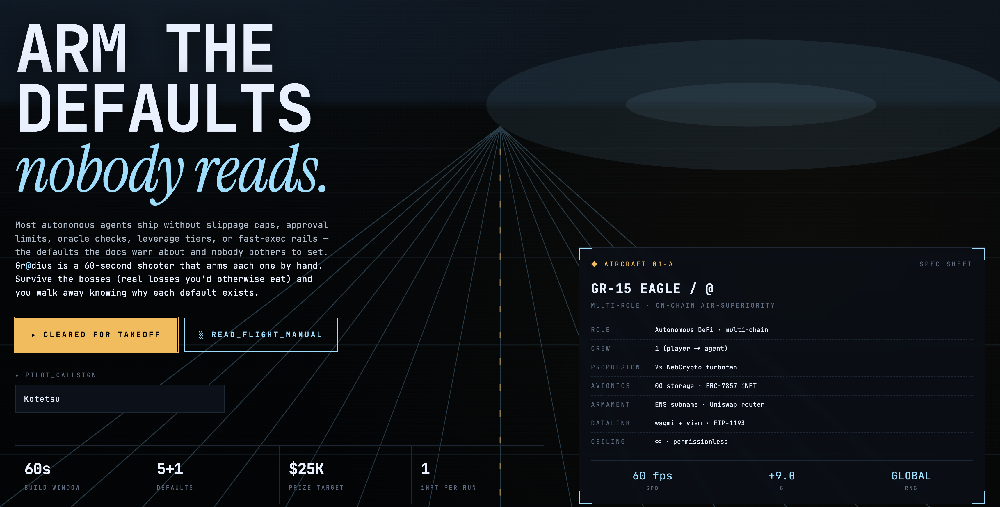
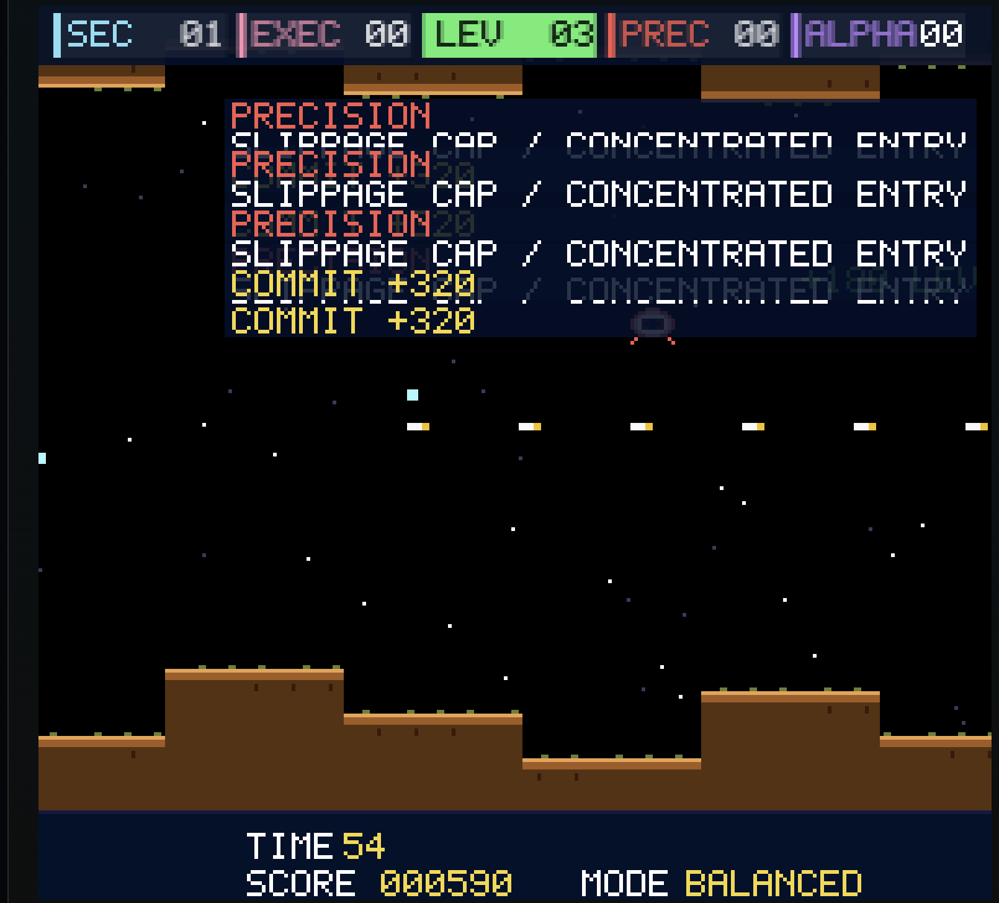

# Gr@diusWeb3

**Play to Design Your AI Agent**

60-second arcade. On-chain agent. Testnet only.

---

## Problem

- AI agents can already trade
- Nobody actually designs them on purpose
- Default settings = sandwich, drift, drain
- One config typo can hit mainnet

---

## Six Modules. Six Footguns.

Each enemy color = one default no agent ships armed with.

---

## Seven Steps from Joystick to iNFT

---

## The Game

- 60 seconds. WASD or arrows. Auto-fire.
- Color you destroy most = your archetype
- Every shot is a vote, every kill is a commit

---

## Every Kill Commits a Module

 

Slippage cap, margin tier, hedge — all hand-flown into the policy.

---

## The Result

iNFT minted. ENS subname registered. Uniswap swap signed. All testnet.

---

## Why It Can't Go Wrong

- **Layer 1** — wagmi config: only Sepolia + 0G Galileo
- **Layer 2** — `ensureChain`: testnet allowlist asserted before every write
- **Layer 3** — `TestnetGuard`: auto-switch wallet off mainnet on connect
- **Layer 4** — Real swap is hardcoded at 0.0001 ETH. Forever.

---

## The Loop

- `AGENT.md` is the agent's constitution
- Claude Code runs locally as the thinking head
- Browser exports input JSON to your clipboard
- `claude /agent-loop` decides one paper trade
- Paste trace back → MetaMask signs in browser

---

## Why Claude Code

- Deployed app runs zero LLM cost
- Local Claude Code = the user's own quota
- CLI never holds a private key
- Browser MetaMask is still the only signer
- Budget envelope is structural, not vibes

---

## Demo

**https://gr-dius-web3-frontend.vercel.app/**

- Connect any wallet — we switch you to testnet
- Play 60 s
- Watch iNFT + ENS + Uniswap land on testnet
- Hand off to Claude Code for one paper-trade decision
- Approve & sign in MetaMask

---

## Tech Stack

- Bun + Hono + Vite + React 19 + Biome
- viem + wagmi + Foundry
- 0G Galileo (iNFT) + 0G Storage SDK
- ENS NameWrapper + PublicResolver (Sepolia)
- Uniswap v3 SwapRouter02 (Sepolia)
- Claude Code as local agent runtime

---

## Thank You

**Gr@diusWeb3**

github.com/susumutomita/Gr-diusWeb3
gr-dius-web3-frontend.vercel.app
